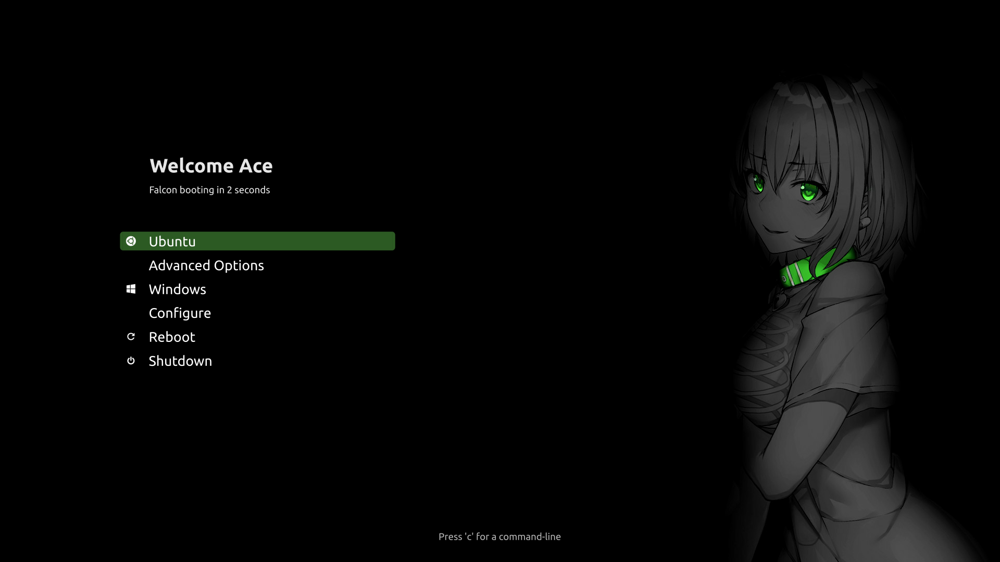

# GRUB Themes

## Anime



### Install Instructions for Ubuntu

1. Download and extract the [tar file](anime/anime.tar.xz)
2. Copy the contents to ```/boot/grub/themes/```
3. Edit ```/etc/default/grub``` by adding
```bash
GRUB_THEME=/boot/grub/themes/anime/theme.txt
```
4. Update GRUB
```bash
sudo update-grub
```
6. Reboot and see your new GRUB menu

### Customise
Open design.svg to make any changes to the text and export as png.  
The 'Booting' text is stored in style.txt  
